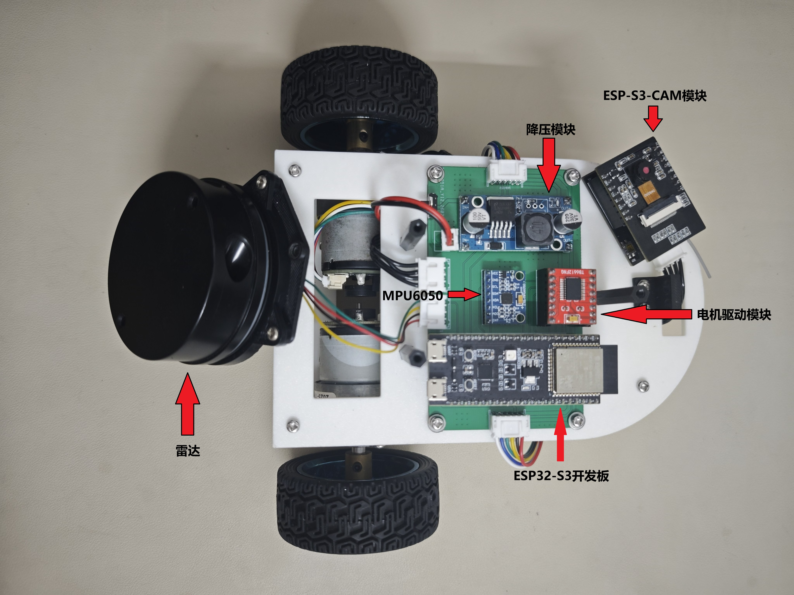
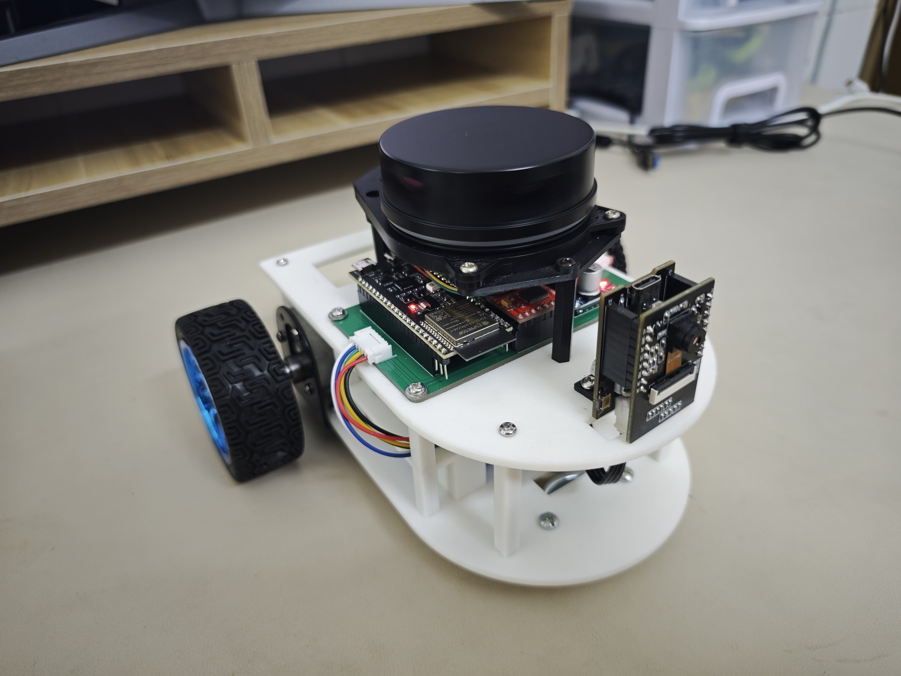
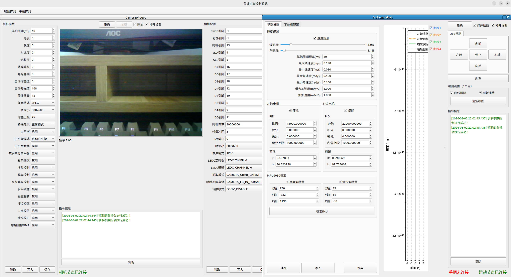
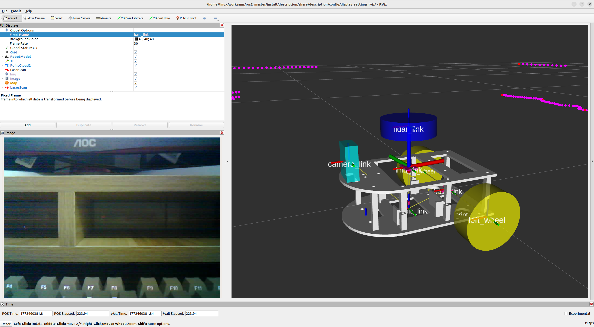
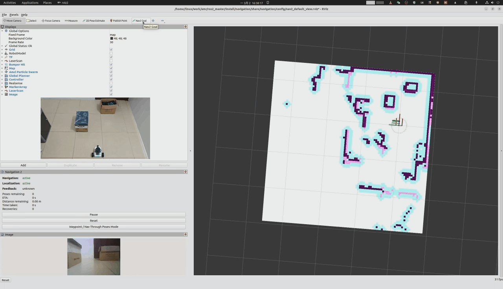

# AMR — 两轮差速自主导航小车

## 项目简介

本项目是一个基于 **ROS2 + ESP32** 的两轮差速后驱自主导航小车（AMR, Autonomous Mobile Robot）。系统采用 **上位机（PC）+ 下位机（ESP32）** 的分布式架构，通过 **micro-ROS** 实现上下位机之间的实时通信。

- **主控芯片**：ESP32-S3（运动控制）+ ESP32-S3-CAM（视觉采集）
- **上位机**：ROS2 Humble + Qt5 桌面控制面板
- **通信方式**：WiFi（micro-ROS）+ 串口（部分传感器）
- **建图导航**：SLAM Toolbox（建图）+ Nav2（导航）
- **视觉识别**：YOLO 目标检测

---

## 系统架构

```
┌─────────────────────────────────────────────────────────────┐
│                     上位机 (PC - Ubuntu 22.04)               │
│  ┌──────────────┐  ┌──────────────┐  ┌──────────────────┐  │
│  │ control_panel │  │ image_detect │  │ navigation/nav2  │  │
│  │  (Qt5 GUI)   │  │   (YOLO)     │  │ (slam_toolbox)   │  │
│  └──────┬───────┘  └──────┬───────┘  └────────┬─────────┘  │
│         │                 │                    │             │
│  ┌──────┴─────────────────┴────────────────────┴─────────┐  │
│  │                  ROS2 Humble 核心                       │  │
│  │  ┌──────────────────────────────────────────────────┐  │  │
│  │  │           micro-ROS-Agent (协议桥接)             │  │  │
│  │  └──────────────────────────────────────────────────┘  │  │
│  │  ┌────────────┐  ┌────────────┐  ┌─────────────────┐   │  │
│  │  │ ydlidar    │  │ serial2wifi│  │ description     │   │  │
│  │  │ (激光雷达)  │  │ (串口转WiFi)│  │ (URDF模型)      │   │  │
│  │  └────────────┘  └────────────┘  └─────────────────┘   │  │
│  └────────────────────────────────────────────────────────┘  │
└─────────────────────────────────────────────────────────────┘
                              │
                      WiFi (micro-ROS)
                              │
┌─────────────────────────────┼──────────────────────────────┐
│                     下位机 (ESP32)                          │
│  ┌──────────────────────────┴───────────────────────────┐  │
│  │        ESP32-S3-CAM (视觉模块)                        │  │
│  │  - OV2640 摄像头图像采集                               │  │
│  │  - 压缩图像发布 (CompressedImage)                      │  │
│  │  - 摄像头参数动态调节                                   │  │
│  │  - 定时拍照/连续拍照                                   │  │
│  └──────────────────────────────────────────────────────┘  │
│                                                             │
│  ┌──────────────────────────────────────────────────────┐  │
│  │        ESP32-S3 (运动控制模块)                         │  │
│  │  - cmd_vel 速度指令接收                                │  │
│  │  - 双轮差速运动学解算                                   │  │
│  │  - PID + 前馈电机控制                                  │  │
│  │  - S曲线速度规划 (Speed Plan)                          │  │
│  │  - MPU6050 IMU 姿态采集                                │  │
│  │  - YDLIDAR 激光雷达数据采集                            │  │
│  │  - 里程计/运动状态发布 (MotionStatus)                   │  │
│  └──────────────────────────────────────────────────────┘  │
│                                                             │
└─────────────────────────────────────────────────────────────┘
```

---

## 目录结构

```
amr/
├── common/                     # 公共基础库（ESP32 模块共用）
│   ├── baseNode.h              # micro-ROS 节点基类（WiFi重连/心跳/序列打印）
│   ├── baseTask.h              # FreeRTOS 任务基类（生命周期管理）
│   ├── settings.h              # 全局配置（WiFi/ROS话题/服务名/TF帧ID）
│   ├── system.h                # 系统工具（WiFi监控/设备重启）
│   ├── singleton.h             # 单例模式模板
│   └── enum.h                  # 服务命令枚举（Motion/Camera Service）
│
├── ESP32_camera/               # ESP32-S3 视觉模块（PlatformIO 项目）
│   ├── src/main.cpp            # 主程序入口
│   ├── platformio.ini          # PlatformIO 配置（esp32_wroom / esp32_s3）
│   └── lib/
│       ├── camera_control/     # 摄像头硬件控制（OV2640驱动/参数管理）
│       ├── camera_node/        # micro-ROS 相机节点
│       ├── micro_ros_platformio/ # micro-ROS PlatformIO 库 (submodule)
│       └── esp32-camera/       # ESP32 摄像头驱动库 (submodule)
│
├── ESP32_motion/               # ESP32-S3 运动控制模块（PlatformIO 项目）
│   ├── src/main.cpp            # 主程序入口
│   ├── platformio.ini          # PlatformIO 配置（esp32_wroom / esp32_s3）
│   ├── include/                # 头文件
│   │   ├── motionNodeTask.h    # micro-ROS 运动节点（cmd_vel订阅/状态发布/服务）
│   │   ├── motionControlTask.h # 运动控制任务（运动学/速度规划/PID控制）
│   │   └── sensorsControlTask.h # 传感器控制任务
│   └── lib/
│       ├── motor_control/      # 电机控制（PID+前馈/编码器/PWM）
│       ├── pid_control/        # PID 控制器
│       ├── ff_control/         # 前馈控制器
│       ├── speed_plan/         # S曲线速度规划器
│       ├── pwm_control/        # PWM 输出控制
│       ├── mpu6050_control/    # MPU6050 IMU 驱动
│       ├── lidar_control/      # YDLIDAR 激光雷达驱动
│       ├── micro_ros_platformio/ # micro-ROS PlatformIO 库 (submodule)
│       └── ESP32Encoder/       # ESP32 编码器库 (submodule)
│
├── ros2_master/                # ROS2 上位机工作空间
│   └── src/
│       ├── control/            # 控制相关功能包
│       │   ├── control_panel/  # Qt5 桌面控制面板（摄像头/运动监控/参数调节）
│       │   ├── control_launch/ # 控制启动文件
│       │   ├── image_detect/   # YOLO 图像检测
│       │   ├── camera_settings_service/ # 摄像头设置服务（.srv 定义）
│       │   ├── motion_settings_service/ # 运动设置服务（.srv 定义）
│       │   ├── motion_status_msgs/      # 运动状态消息（.msg 定义）
│       │   ├── micro-ROS-Agent/  # micro-ROS 代理 (submodule)
│       │   └── micro_ros_msgs/   # micro-ROS 消息定义 (submodule)
│       ├── lidar/              # 激光雷达功能包
│       │   ├── ydlidar/        # YDLIDAR 雷达驱动
│       │   ├── serial2wifi/    # 串口转WiFi（TCP/UDP/Serial Server）
│       │   └── lidar_launch/   # 雷达启动文件
│       ├── nav2/               # 导航功能包
│       │   ├── navigation/     # Nav2 + SLAM Toolbox 配置与启动
│       │   └── command/        # 导航指令脚本（目标点/初始化/保存地图/路径点）
│       ├── description/        # 机器人 URDF 模型与网格文件
│       └── script/             # 实用脚本（进程管理）
│
├── micro_ros/                  # micro-ROS 固件编译配置
│   └── micro_ros_setup/        # micro-ROS 编译工具 (submodule)
│
├── test/                       # 测试代码
│   └── yolo_test/              # YOLO 检测测试
│
└── doc/                        # 项目文档与图片
    ├── images/                 # 实物照片与截图
    ├── PCB/                    # 电路板设计文件
    └── model/                  # 3D 模型文件
```

---

## 硬件组成

| 模块 | 型号/规格 | 说明 |
|------|-----------|------|
| 主控 | ESP32-S3 DevKitC-1 | 运动控制主控 |
| 视觉 | ESP32-S3-CAM (OV2640) | 200W像素摄像头模块 |
| 电机驱动 | TB6612 / L298N | 双路直流电机驱动 |
| 电机 | JGA37-520 编码电机 | 带霍尔编码器 |
| IMU | MPU6050 | 6轴惯性测量单元 |
| 激光雷达 | YDLIDAR X2/X4 | 360° 激光测距 |
| 电源 | 12V 锂电池 | 整车供电 |

---

## 软件架构

### 下位机（ESP32）

基于 **Arduino 框架** 使用 **PlatformIO** 开发，采用 **FreeRTOS 多任务** 架构：

| 任务 | 核心 | 优先级 | 描述 |
|------|------|--------|------|
| `motion_node_task` | Core 0 | 9 | micro-ROS 通信节点（WiFi/WiFi重连/cmd_vel订阅/状态发布/服务回调） |
| `motion_control_task` | Core 1 | 12 | 运动控制（运动学解算/速度规划/PID控制/电机驱动） |
| `sensors_control_task` | Core 1 | 9 | 传感器采集（MPU6050/YDLIDAR） |
| `camera_node_task` | Core 0 | 9 | 摄像头通信节点（图像发布/参数服务） |

**核心功能**：
- **运动学模型**：两轮差速驱动，支持前进/后退/原地旋转
- **速度规划**：S曲线加减速，支持 jerk（加加速度）限制
- **电机控制**：PID + 前馈（Feed-Forward）双闭环控制
- **参数持久化**：使用 ESP32 Preferences（NVS）存储配置

### 上位机（PC）

基于 **ROS2 Humble**，核心功能包：

| 功能包 | 描述 |
|--------|------|
| `control_panel` | Qt5 GUI 控制面板（实时摄像头画面/运动状态曲线/参数在线调节） |
| `image_detect` | YOLO 目标检测节点 |
| `ydlidar` | YDLIDAR 激光雷达驱动节点 |
| `serial2wifi` | 串口-TCP/UDP WiFi 透传服务器 |
| `navigation` | Nav2 导航栈 + SLAM Toolbox 在线建图 |
| `command` | 导航指令（设定目标点/初始化位姿/保存地图/路径点跟随） |
| `description` | 机器人 URDF 模型 + TF 坐标变换树 |
| `micro-ROS-Agent` | micro-ROS ↔ ROS2 协议桥接代理 |

### 通信拓扑

```
ESP32-Camera  ──WiFi(micro-ROS)──┐
ESP32-Motion  ──WiFi(micro-ROS)──┤
YDLIDAR ──串口── ESP32-Motion ───┼── micro-ROS-Agent ── ROS2 核心
```

**ROS2 话题列表**：

| 话题 | 类型 | 方向 | 说明 |
|------|------|------|------|
| `/cmd_vel` | `geometry_msgs/Twist` | PC→ESP32 | 导航速度指令 |
| `/esp32/motion_status_topic` | `motion_status_msgs/MotionStatus` | ESP32→PC | 运动状态（速度/里程/IMU/雷达） |
| `/esp32/compressed_image_topic` | `sensor_msgs/CompressedImage` | ESP32→PC | 压缩图像 |
| `/odom` | `nav_msgs/Odometry` | PC发布 | 里程计（融合后） |
| `/imu` | `sensor_msgs/Imu` | PC发布 | IMU数据 |
| `/joint_states` | `sensor_msgs/JointState` | PC发布 | 关节状态 |

**ROS2 服务列表**：

| 服务 | 说明 |
|------|------|
| `/esp32/motion_settings_service` | 运动参数/配置读写保存（PID/前馈/速度规划/电机引脚等） |
| `/esp32/camera_settings_service` | 摄像头参数读写保存 |

---

## 开发环境

| 工具/软件 | 版本/说明 |
|-----------|-----------|
| 操作系统 | Ubuntu 22.04 |
| ROS2 | Humble Hawksbill |
| Qt | 5.x（桌面控制面板） |
| IDE | VS Code + PlatformIO 插件 |
| 下位机框架 | Arduino (ESP32) + FreeRTOS |
| 3D 建模 | FreeCAD |
| 电路设计 | 嘉立创专业版 (EasyEDA Pro) |

---

## 快速开始

### 1. 克隆仓库

```bash
git clone --recurse-submodules <repo-url>
cd amr
```

### 2. 编译 micro-ROS 固件库

参见 [micro_ros/](micro_ros/) 目录下的说明，使用 micro_ros_setup 工具生成 PlatformIO 所需的静态库。

### 3. 编译并烧录 ESP32 固件

使用 VS Code 打开 `ESP32_motion/` 或 `ESP32_camera/` 目录，通过 PlatformIO 插件：

- **ESP32_motion**：选择 `esp32_wroom`（ESP32 标准版）或 `esp32_s3`（ESP32-S3）
- **ESP32_camera**：选择 `esp32_wroom` 或 `esp32_s3`（需 PSRAM）

```bash
# 或使用 PlatformIO CLI
cd ESP32_motion
pio run -e esp32_s3 --target upload
```

### 4. 编译上位机 ROS2 工作空间

```bash
cd ros2_master
colcon build
source install/setup.bash
```

### 5. 启动系统

系统提供了模块化的 launch 文件，可根据需求组合启动。启动前需确保 ESP32 设备已上电并连接 WiFi，且 `common/settings.h` 中的 WiFi 配置与路由器匹配。

#### 5.1 仅查看机器人模型（不需要下位机）

```bash
ros2 launch description description.launch.py
```

启动 `robot_state_publisher`（发布 URDF 模型）和 `rviz2`，用于离线查看机器人 3D 模型和 TF 坐标树。

#### 5.2 启动基础控制系统（遥控/图像）

```bash
ros2 launch control_launch control.launch.py
```

此命令启动以下节点：

| 节点 | 功能 |
|------|------|
| `micro_ros_agent` | micro-ROS UDP 代理（端口 8888），与 ESP32 通信 |
| `control_panel` | Qt5 桌面控制面板（实时图像/运动状态/参数调节） |
| `yolo_detect` | YOLO 目标检测（订阅摄像头图像） |
| `ekf_node` | robot_localization EKF 融合（输出 `/odom_filtered`） |
| `robot_state_publisher` | 发布 TF 坐标变换（URDF 模型） |
| `description_rviz2` | rviz2 显示机器人模型 |

#### 5.3 启动激光雷达

```bash
ros2 launch lidar_launch lidar.launch.py
```

启动 `serialserver`（串口转 WiFi 透传）、`ydlidar_node`（雷达驱动）和 `scan_to_scan_filter_chain`（激光滤波）。

> **注意**：YDLIDAR 通过串口连接 ESP32，雷达数据经 ESP32 通过 micro-ROS 上传至 PC。若雷达直连 PC 串口，需调整 `lidar_params.yaml` 中的串口配置。

#### 5.4 建图模式（SLAM）

```bash
ros2 launch navigation slam_toolbox.launch.py
```

自动启动 `control.launch.py` + `lidar.launch.py` + `slam_toolbox`（online_async 在线建图），使用游戏手柄或 `control_panel` 遥控小车移动完成环境建图。

**保存地图**：

```bash
ros2 run command save_map
```

地图默认保存至 `ros2_master/src/nav2/navigation/map/room.yaml`，保存路径可在 `save_map.py` 中修改。

#### 5.5 导航模式（Nav2）

```bash
ros2 launch navigation navigation.launch.py
```

自动启动 `control.launch.py` + `lidar.launch.py` + `nav2_bringup`（导航栈）+ `rviz2`（导航视图），并在 1 秒后自动初始化位姿。

**发送导航目标**：

```bash
# 移动到指定坐标（x, y, 角度）
ros2 run command goto_pose 1.0 0.5 0.0

# 路径点跟随
ros2 run command waypoints_follow
```

#### 5.6 一键启动全部（建图 or 导航）

```bash
# 建图
ros2 launch navigation slam_toolbox.launch.py

# 导航（需先完成建图并保存地图）
ros2 launch navigation navigation.launch.py
```

两者均已包含 `control.launch.py` 和 `lidar.launch.py`，无需单独启动。

#### 5.7 启动流程总结

```
                    ┌─────────────────────────────┐
                    │  1. ESP32 上电，连接 WiFi    │
                    └─────────────┬───────────────┘
                                  │
                    ┌─────────────▼───────────────┐
                    │  2. 启动 micro_ros_agent     │
                    │     (含于 control.launch)    │
                    └─────────────┬───────────────┘
                                  │
                    ┌─────────────▼───────────────┐
                    │  3. ESP32 自动连接 agent     │
                    │     建立 micro-ROS 通信      │
                    └─────────────┬───────────────┘
                                  │
               ┌──────────────────┼──────────────────┐
               │                  │                  │
     ┌─────────▼──────┐  ┌───────▼───────┐  ┌───────▼──────┐
     │  建图模式       │  │  导航模式      │  │  遥控模式     │
     │  slam_toolbox  │  │  navigation   │  │  control     │
     │  (遥控+建图)    │  │  (自主导航)    │  │  (手动遥控)   │
     └────────────────┘  └───────────────┘  └──────────────┘

```

## 实物展示

### 各模块


### 小车


### 上位机软件


### rviz2


### 建图（2.5倍速播放）


### 导航（2倍速播放）


---

## 第三方依赖

### ESP32 固件库（submodule）
- [micro_ros_platformio](https://github.com/micro-ROS/micro_ros_platformio) — micro-ROS PlatformIO 集成
- [esp32-camera](https://github.com/espressif/esp32-camera) — ESP32 摄像头驱动
- [ESP32Encoder](https://github.com/madhephaestus/ESP32Encoder) — ESP32 编码器库

### ROS2 包（submodule）
- [micro-ROS-Agent](https://github.com/micro-ROS/micro-ROS-Agent) — micro-ROS 代理
- [micro_ros_msgs](https://github.com/micro-ROS/micro_ros_msgs) — micro-ROS 消息定义
- [micro_ros_setup](https://github.com/micro-ROS/micro_ros_setup) — micro-ROS 编译配置工具

---

## 许可证

本项目基于 [LICENSE](LICENSE) 文件中的条款发布。


